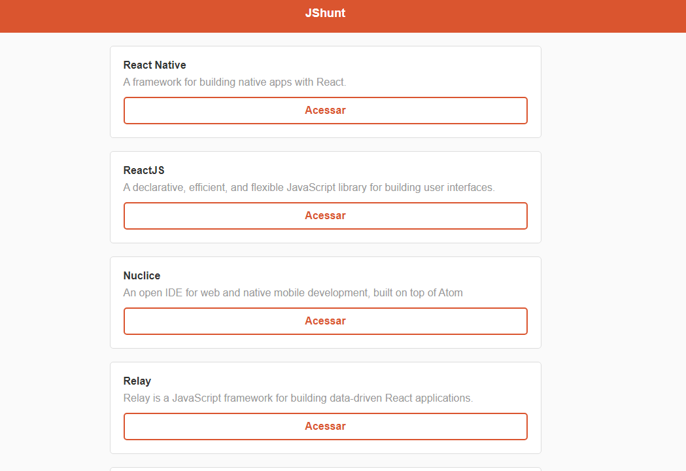

<h3 align="center">
    
    <br><br>
    <b>Search Javascript based tools.</b> 
</h3>

<p align="center">
  <a href="https://www.linkedin.com/in/sandersz/">
    
  </a>

  

  

  <a href="https://jshunt-reactjs.netlify.app">
    
  </a>
</p>

## :computer: Web

<h1 align="center">
    <a href="https://jshunt-reactjs.netlify.app">
        
    </a>
</h1>

## :bookmark: About

The <strong>JSHunt</strong> is a web app made to search javascript based tools.

## :rocket: Tech Used

This project was made with the following technologies:

- [ReactJS](https://reactjs.org/)

## :fire: How to

- ### **Requirements**

  - It's **necessary** **[Node.js](https://nodejs.org/en/)**
  - You, **need** a package manager like **[NPM](https://www.npmjs.com/)** or **[Yarn](https://yarnpkg.com/)**.

1. Clone the repo :

```sh
  $ git clone https://github.com/sanderdsz/jshunt.git
```

2. Execute the app:

```sh
  # Install all dependencies
  $ cd jshunt
  $ npm install

  # Start the web application
  $ npm run start
```

## :memo: License

This project is under MIT license. [LICENSE](LICENSE.md)

## :mailbox_with_mail: Get in touch!

<a href="https://sanderzuchinalli.netlify.app/" target="_blank" >
  
</a>&nbsp;&nbsp;&nbsp;
<a href="https://www.linkedin.com/in/sandersz/" target="_blank" >
  
</a>&nbsp;&nbsp;&nbsp;
<a href="mailto:sanderdsz@gmail.com" target="_blank" >
  
</a> 